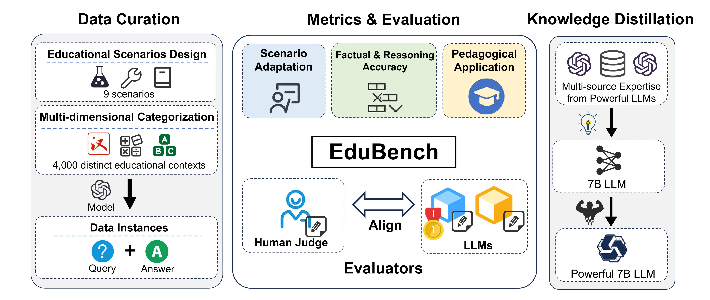
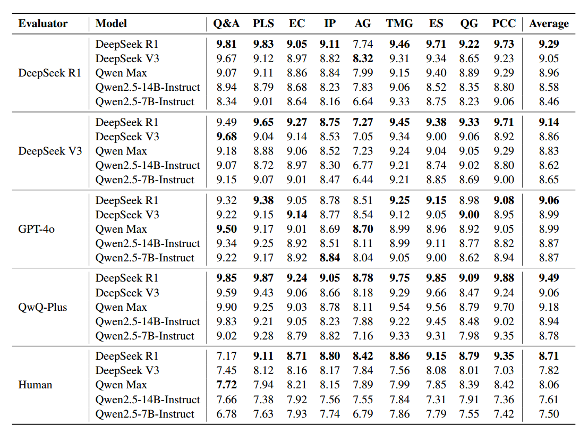
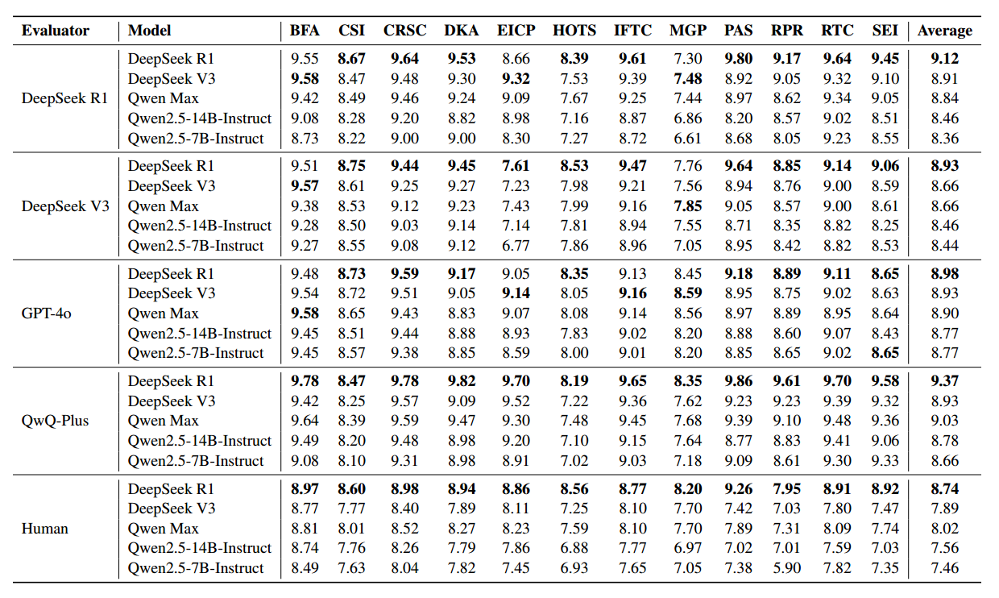
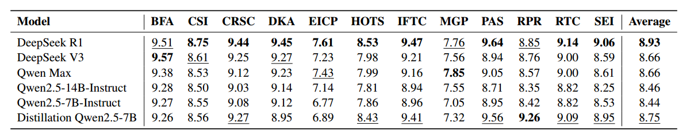
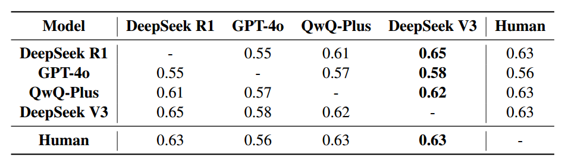

# EduBench: A Comprehensive Benchmarking Dataset for Evaluating Large Language Models in Diverse Educational Scenarios

  📄 <a href="https://arxiv.org/pdf/2505.16160 " target="_blank">Paper</a> &nbsp; | &nbsp;
  🤗 <a href="https://huggingface.co/DirectionAI/EDU-Qwen2.5-7B " target="_blank">Model</a> &nbsp; | &nbsp;
  🎰 <a href="https://huggingface.co/datasets/DirectionAI/EduBench " target="_blank">Datasets</a> &nbsp; | &nbsp;
  ⚖️ <a href="" target="_blank">MIT License</a>

# Table of Contents
- [Overview](#overview)
- [Educational Scenarios and Evaluation Dimensions](#educational-scenarios-and-evaluation-dimensions)
- [Experiments and Analysis](#experiments-and-analysis)
  - [Evaluation Results](#evaluation-results)
  - [Model Distillation](#model-distillation)
  - [Consistency Analysis Between Model and Human Evaluation](#consistency-analysis-between-model-and-human-evaluation)

---

## Overview

Introducing EduBench 📚 – the first-ever comprehensive benchmark dataset 🌟 designed specifically for the diverse world of educational scenarios! With 9 major educational scenarios 🏫 and over 4,000 unique educational situations 🔍, EduBench is set to revolutionize how we evaluate and optimize educational models.

Our innovative multi-dimensional evaluation framework 🛠️ stands out by covering 12 critical dimensions 🧠 across both student- and teacher-oriented settings, ensuring thorough assessments of scenario adaptation, factual accuracy, reasoning precision, and more.

But that’s not all! 💡 Through cutting-edge knowledge distillation techniques 🔬, we’ve empowered smaller models like Qwen2.5-7B-Instruct to deliver performance on par with state-of-the-art giants such as DeepSeek V3 and Qwen Max, even when trained with limited data. EduBench isn’t just a benchmark; it’s a game-changer in educational model development 🚀.

  
   
  <strong>The left part illustrates our data curation procedure; the middle part showcases our three main evaluation principles and our investigation into the alignment of LLMs with human judgment; the right part shows how our data can boost the performance of smaller models.</strong>

---

## Educational Scenarios and Evaluation Dimensions

  
   
  <strong>The left part presents our 9 educational scenarios along with their multidimensional educational backgrounds and corresponding metrics. The right part displays the results from human evaluation on EduBench.</strong>

 

### Classification of Educational Scenarios

We classify the educational scenarios based on their target users:

#### I. Student-Oriented Scenarios

- Question & Answering (Q&A)
- Error Correction (EC)
- Idea Provision (IP)
- Personalized Learning Support (PLS)
- Emotional Support (ES)

#### II. Teacher-Oriented Scenarios

- Question Generation (QG)
- Automatic Grading (AG)
- Teaching Material Generation (TMG)
- Personalized Content Creation (PCC)

### Design of Evaluation Metrics

Based on the defined educational scenarios, we have designed a comprehensive set of evaluation metrics, with 4 sub-metrics per scenario, totaling **12 core evaluation metrics**.

#### 1. Scenario Adaptation

This metric evaluates whether model responses are contextually appropriate and aligned with educational expectations.

- **Instruction Following & Task Completion**
- **Role & Tone Consistency**
- **Content Relevance & Scope Control**
- **Scenario Element Integration**

#### 2. Factual & Reasoning Accuracy

This metric assesses the correctness of information and the rigor of reasoning in model responses.

- **Basic Factual Accuracy**
- **Domain Knowledge Accuracy**
- **Reasoning Process Rigor**
- **Error Identification & Correction Precision**

#### 3. Pedagogical Application

This metric evaluates whether responses embody sound educational principles and effectively support student learning.

- **Clarity, Simplicity & Inspiration**
- **Motivation, Guidance & Positive Feedback**
- **Personalization, Adaptation & Learning Support**
- **Higher-Order Thinking & Skill Development**

---

## Experiments and Analysis

### Evaluation Results

  
   
  <strong>Table 1: Average domain-level scores across different models.</strong>

  
   
  <strong>Table 2: Average metric-level scores across different models.</strong>

**Model Evaluation Results**  
DeepSeek R1 demonstrates the best overall performance across different metrics, while Qwen2.5-7B-Instruct performs the worst in Table 2. Additionally, DeepSeek R1 excels in "Higher-Order Thinking & Skill Development," whereas Qwen2.5-7B-Instruct underperforms significantly in "Error Identification & Correction Precision," showing a clear gap compared to other models. In specific scenarios, DeepSeek R1 remains the top performer, while Qwen2.5-7B-Instruct outperforms Qwen2.5-14B-Instruct in areas such as "Emotional Support" and "Personalized Content Creation."

**Human Evaluation Results**  
In Table 2, DeepSeek R1 and Qwen2.5-7B-Instruct still demonstrate the best and worst performances respectively, consistent with the model-based evaluation results. Unlike model evaluation, human annotators express notably lower satisfaction with all five models' performance on the "Reasoning Process Rigor" metric. Notably, Qwen2.5-7B-Instruct scores only 5.90 on this metric. In contrast, DeepSeek R1 consistently performs well on the "Motivation, Guidance & Positive Feedback" metric, even when other models fall short. At the scenario level, DeepSeek R1 remains far ahead according to Table 1, while the performance gap between the 7B and 14B versions of the Qwen series is relatively small, making the 7B model a cost-effective option in resource-constrained settings.

---

### Model Distillation

  

The above figure compares the distilled model's performance with other models across various metrics:

- **Dataset Construction**: To fully leverage the strengths of different generation models across various educational scenarios, we adopt a multi-source distillation pipeline. For each task, we select the best-performing model on the test set as the response generator, using it to answer educational questions and construct the training dataset for the distillation model. Through this process, we obtain a training set of 4,000 samples covering various subtasks across all 9 educational scenarios.
- **Performance Results**: After distillation, the 7B model shows significant improvements across 10 out of 12 metrics, achieving performance comparable to current state-of-the-art models. Notably, it outperforms all other models, including DeepSeek R1 and Qwen Max, on the "Reasoning Process Rigor" metric.

---

### Consistency Analysis Between Model and Human Evaluation

  

The above figure shows Kendall’s W values between different evaluation models and human evaluation:

- **Consistency Among Evaluation Models**: The models exhibit high consistency, with most Kendall’s W values above 0.5 and many around 0.6. DeepSeek V3 shows the highest consistency with other models, closely matching their average score rankings.
- **Consistency Between Humans and Models**: There is not perfect agreement between model evaluations and human judgments, possibly due to limitations in the models’ understanding of the evaluation criteria. Overall, DeepSeek V3 shows the highest correlation with human evaluation, while GPT-4o exhibits the lowest. This pattern may be attributed to DeepSeek V3's larger model size and extensive training data distribution.

---
